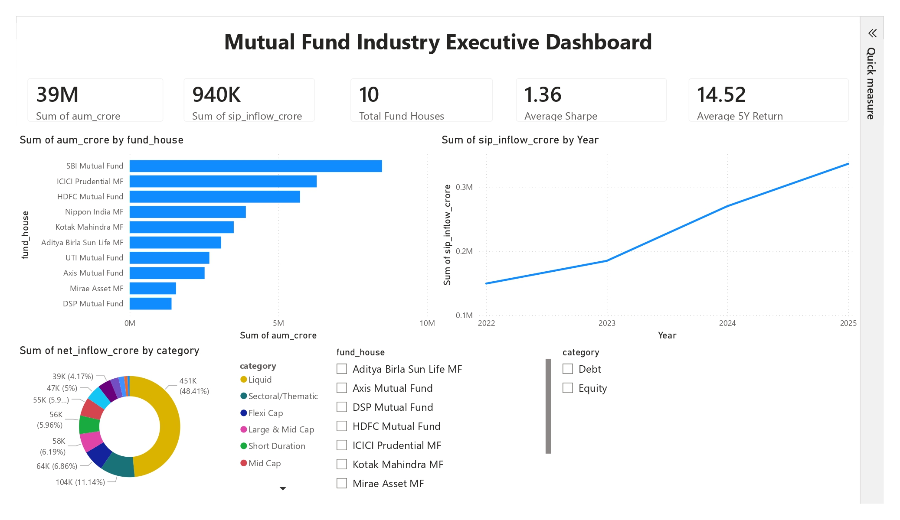
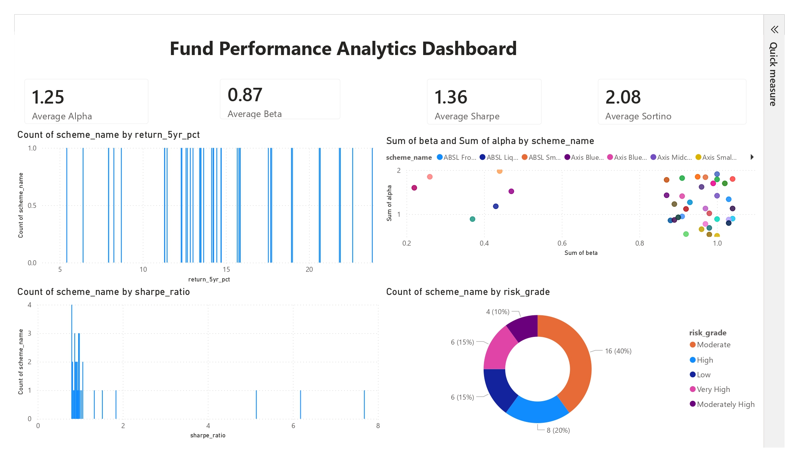
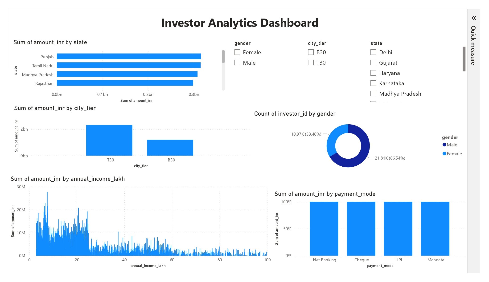
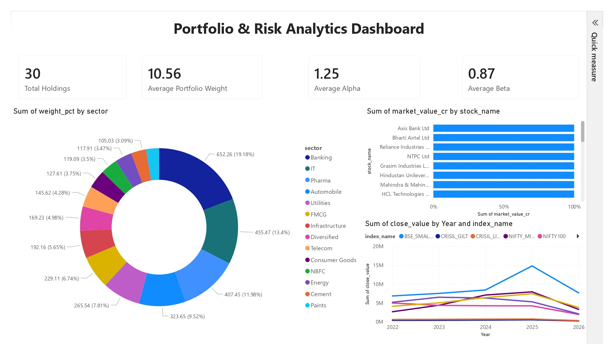
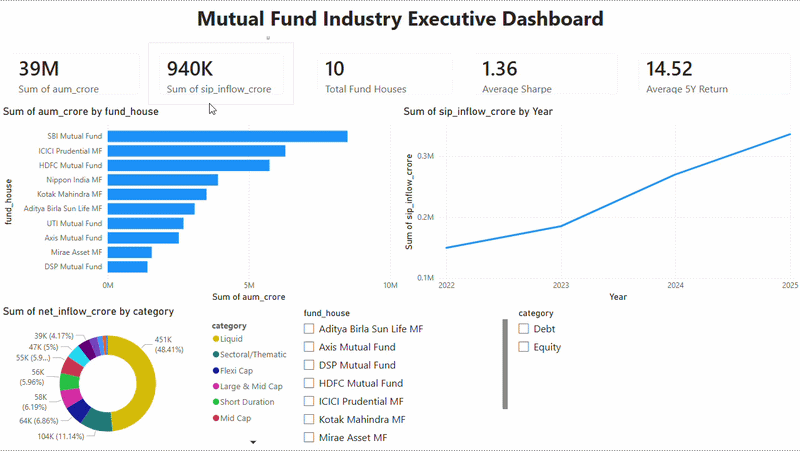

# Mutual Fund Industry Intelligence Dashboard


> End-to-end financial analytics with Power BI, Python, SQL, and advanced investor intelligence for the mutual fund ecosystem.

---

## Professional Introduction

This project delivers a polished, recruiter-grade Mutual Fund Industry Intelligence Dashboard built for decision makers in asset management, wealth management, and financial analytics. It combines clean data engineering, robust ETL processing, SQL-backed data modeling, Python analytics, and Power BI storytelling to transform real-world mutual fund datasets into actionable business insights.

### Dashboard Preview









---

## GIF Demo



---


## Business Problem Statement

Financial advisors and fund managers need a single source of truth to understand mutual fund performance, investor behavior, portfolio diversification, benchmark alignment, and risk trends. This dashboard answers those needs by converting fragmented mutual fund datasets into executive-grade intelligence.

## Project Objectives

- Build a multi-page Power BI dashboard for mutual fund analytics
- Deliver executive KPIs, fund performance, investor insights, portfolio and risk analysis
- Implement a repeatable ETL pipeline for raw financial datasets
- Ensure the project is recruiter-friendly and demonstrates data analytics expertise
- Generate evidence-based insights that support business decision making

## System Architecture Diagram

> The architecture uses Python for ETL and analytics, SQLite for structured storage, and Power BI for visualization and BI reporting.

```text
Raw data CSVs -> Python ETL Pipeline -> SQLite staging/data warehouse -> Power BI data model -> Interactive dashboards
```

---

## Dataset Overview

| Dataset | Description | Use Case |
|---|---|---|
| Fund Master Data | Scheme metadata and fund details | Portfolio classification, fund house analysis |
| NAV History | Historical NAV records | Performance trend analysis, benchmarking |
| AUM by Fund House | Assets under management by sponsor | Market share and fund house sizing |
| Monthly SIP Inflows | Systematic investment inflow trends | Investor accumulation and SIP growth |
| Category Inflows | Fund category cash flow analysis | Sector and category momentum tracking |
| Industry Folio Count | Investor folio and account trends | Retail participation and account growth |
| Scheme Performance | Risk-adjusted performance metrics | Fund ranking and peer comparison |
| Investor Transactions | Buy/sell transaction history | Behavior analysis, churn, and flow patterns |
| Portfolio Holdings | Asset allocation and exposure details | Diversification and sector risk analysis |
| Benchmark Indices | Benchmark returns for comparison | Relative performance and attribution |

---

## ETL Pipeline Explanation

The ETL pipeline is designed for reliability and transparency:

1. Extract raw CSV files from the `data/` folder
2. Transform datasets using Python and Pandas
3. Clean, standardize, and enrich financial metrics
4. Load transformed tables into a SQLite database
5. Export curated datasets for Power BI consumption

This architecture supports reproducible analytics and simplified maintenance.

---

## Data Cleaning Process

The cleaning process includes:

- Standardizing date and currency formats
- Removing duplicate records and invalid entries
- Handling missing values with business-aware imputations
- Normalizing fund identifiers and category labels
- Validating NAV, AUM, and transaction values
- Generating derived analytics fields for risk and return assessment

---

## Database Schema Overview

The analytics model is built on a SQLite relational schema with the following structure:

- `fund_master`
- `nav_history`
- `aum_by_fund_house`
- `monthly_sip_inflows`
- `category_inflows`
- `industry_folio_count`
- `scheme_performance`
- `investor_transactions`
- `portfolio_holdings`
- `benchmark_indices`

This schema enables fast joins, trend calculations, and cross-functional mutual fund analytics.

---

## Power BI Dashboard Pages Explanation

- **Executive Overview Dashboard**: High-level KPIs, strategy summary, fund house market share, and industry movement.
- **Fund Performance Analytics Dashboard**: Comparative NAV trends, return distribution, top/bottom performing schemes, and benchmark relative returns.
- **Investor Analytics Dashboard**: SIP growth, folio segmentation, transaction flow, and investor behavior insights.
- **Portfolio & Risk Analytics Dashboard**: Asset allocation, diversification heatmaps, risk metrics, volatility analysis, and portfolio stress indicators.

---

## Key Insights Generated

- Identified top-performing fund categories using benchmark-relative returns
- Highlighted SIP growth momentum for retail investor opportunity sizing
- Revealed portfolio concentration risk across key sectors and asset classes
- Mapped fund performance against benchmark indices for attribution
- Tracked fund house AUM shifts to detect market leadership trends

---

## KPI Metrics

- Total AUM coverage
- Average NAV growth rate
- SIP inflow CAGR
- Category inflow momentum
- Portfolio concentration ratio
- Risk-adjusted return scores
- Benchmark variance and tracking error

---

## Technical Implementation

- Python + Pandas for ETL, data cleaning, feature engineering
- SQLite for structured analytics storage and query performance
- SQL for data aggregation, joins, and financial calculations
- Power BI for multi-page dashboards, KPI cards, drill-through, and visual storytelling
- CSV datasets as source files for reproducible analytics

---

## Project Folder Structure

```text
.
├── data/
│   ├── 01_fund_master.csv
│   ├── 02_nav_history.csv
│   ├── 03_aum_by_fund_house.csv
│   ├── 04_monthly_sip_inflows.csv
│   ├── 05_category_inflows.csv
│   ├── 06_industry_folio_count.csv
│   ├── 07_scheme_performance.csv
│   ├── 08_investor_transactions.csv
│   ├── 09_portfolio_holdings.csv
│   └── 10_benchmark_indices.csv
├── database/
│   └── schema.sql
├── notebooks/
├── outputs/
│   ├── charts/
│   └── Cleaned_Data/
├── scripts/
│   ├── check_columns.py
│   ├── database_loader.py
│   ├── eda_analysis.py
│   ├── etl_pipeline.py
│   ├── live_nav_fetch.py
│   ├── recommendation_engine.py
│   └── risk_analytics.py
├── assets/
│   ├── executive_overview.png
│   ├── fund_performance.png
│   ├── investor_analytics.png
│   ├── portfolio_risk.png
│   └── demo.gif
├── power.pbix
└── README.md
```

---

## Installation Guide

1. Clone the repository:
   ```bash
   git clone https://github.com/animesh6532/Mutual-Fund-Industry-Intelligence-Dashboard.git
   cd Mutual-Fund-Industry-Intelligence-Dashboard
   ```

2. Create a Python environment:
   ```bash
   python -m venv venv
   .\venv\Scripts\activate
   ```

3. Install dependencies:
   ```bash
   pip install -r requirements.txt
   ```

4. Confirm the `assets/` folder contains the Power BI images and demo GIF for presentation.

---

## How to Run the Project

1. Run the ETL pipeline:
   ```bash
   python scripts/etl_pipeline.py
   ```

2. Load the SQLite database if required:
   ```bash
   python scripts/database_loader.py
   ```

3. Open the Power BI report:
   - Open `power.pbix` in Power BI Desktop.
   - Refresh the report data from the transformed SQLite datasets.

4. Review analytics notebooks and export reports in `outputs/`.

---

## Dashboard Walkthrough

- Start in the Executive Overview for board-level metrics and fund house context.
- Move to Fund Performance to compare schemes by return, volatility, and benchmark alignment.
- Review Investor Analytics for SIP momentum, folio growth, and transaction patterns.
- Finish with Portfolio & Risk to assess diversification, concentration, and stress metrics.

---

## Business Impact

- Enables faster investment thesis validation for wealth managers and portfolio teams.
- Provides data-driven insights to reduce risk and optimize allocation.
- Supports strategic decision making with KPI-driven reporting and benchmark comparisons.
- Converts complex mutual fund data into executive-ready dashboards.

---

## Challenges Solved

- Integrated heterogeneous mutual fund datasets into a unified analytics model
- Built a robust ETL flow for data preparation and quality enforcement
- Delivered financial KPIs that align with business and investment decisions
- Designed a Power BI experience for both executive and analyst audiences

---

## Future Enhancements

- Add scenario modeling for portfolio stress testing and allocation simulations
- Incorporate live data refresh from mutual fund NAV APIs
- Add predictive analytics for SIP inflows and return forecasting
- Extend dashboard with drill-through investor segmentation and cohort analysis
- Implement role-level security for different stakeholder views

---

## Skills Demonstrated

- Power BI dashboard design and storytelling
- Python scripting and Pandas data engineering
- SQL data modeling and financial analytics
- ETL process development and reproducibility
- Risk analytics and investment performance measurement
- Business intelligence and executive reporting

---

## Resume-Worthy Project Highlights

- Developed an end-to-end mutual fund analytics platform using Power BI and Python
- Built an ETL pipeline that transforms 10 financial datasets into a unified analytics database
- Designed multi-page BI dashboards for performance, investor, portfolio, and risk analytics
- Demonstrated strong business impact through KPI-driven financial reporting
- Optimized analytics for stakeholder decision making and investment monitoring

---

## Recruiter Takeaways

- Strong proficiency in Power BI, Python, SQL, and ETL for financial analytics
- Ability to translate raw financial data into strategic business insights
- Experience building dashboard solutions for investment and portfolio teams
- Focus on data quality, reproducibility, and impactful analytics storytelling
- Portfolio-ready project that reflects technical depth and business acumen

---

## Technologies Used

- Power BI
- Python
- Pandas
- SQLite
- SQL
- ETL Pipeline
- Data Cleaning
- Financial Analytics
- Data Visualization
- Business Intelligence

---

## GitHub Stats


---

## Author

**Animesh Sahoo**

- GitHub: [animesh6532](https://github.com/animesh6532)
- LinkedIn: [Animesh Sahoo](https://www.linkedin.com/in/animesh-sahoo-b03151302/)

---

## Professional Contact

For collaboration, technical reviews, or hiring inquiries, please connect via GitHub or LinkedIn.
